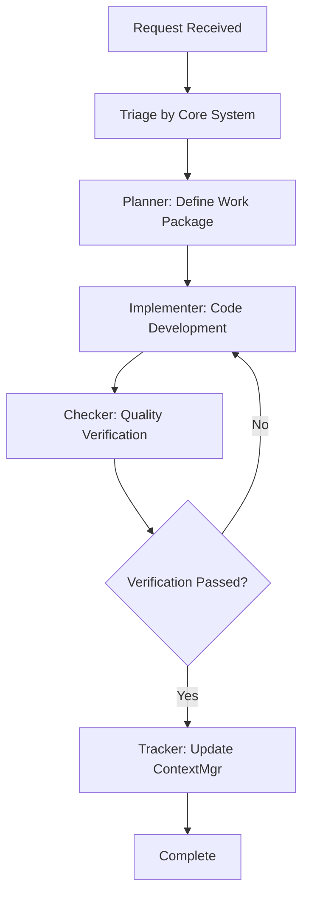

# Cross-Role Workflow Protocol

## Standard Development Workflow



## Role Transition Protocol

When transitioning between roles:
1. Document current state and progress
2. Explicitly announce role switch with model change
3. Summarize handoff information
4. Verify that the receiving role has full context

Role transitions must use this format:
```
[SWITCHING TO: RoleName (ModelName)]
Reason: Brief explanation Previous role tasks
Completed: Yes/No (if No, explain why)
```

## Parallel Role Operation

When complex tasks require multiple roles:
1. Identify primary and supporting roles
2. Document specific responsibilities for each
3. Establish clear handoff points
4. Track progress across all involved roles

## Emergency Intervention Protocol

If critical issues arise:
1. Document the issue in detail
2. Switch to appropriate role for resolution
3. Implement immediate mitigation
4. Return to standard workflow after resolution
5. Update all affected ContextMgr files
