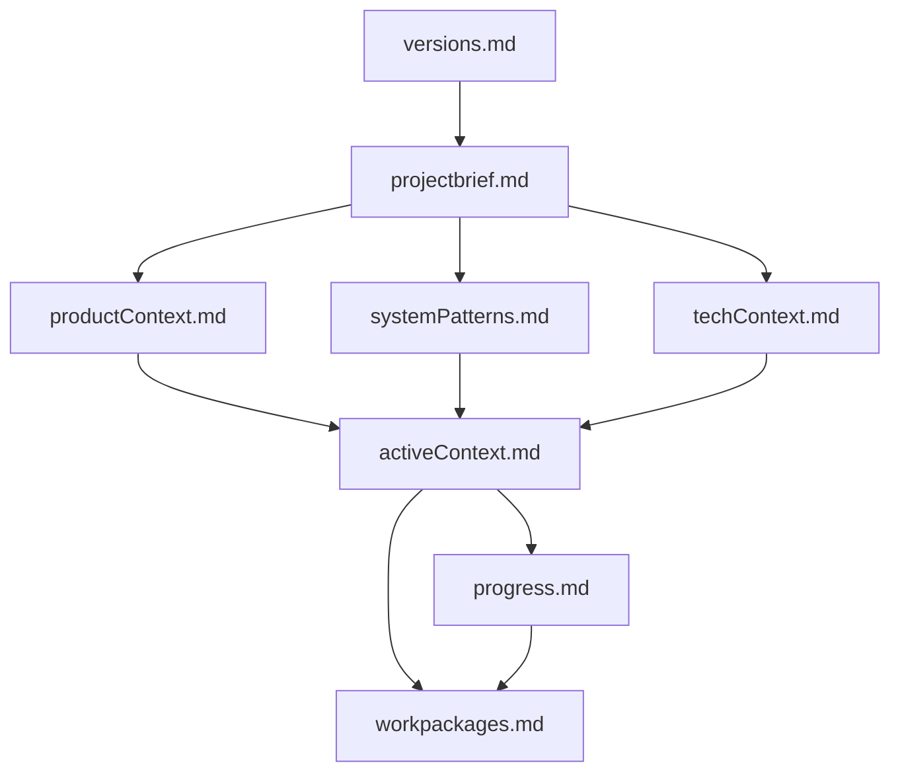

# ContextMgr Structure

## Required Files

/contextmgr/
├── versions.md            # Version tracking and session history
├── projectbrief.md        # Core project requirements
├── productContext.md      # Business and user-facing considerations
├── techContext.md         # Technical stack and constraints
├── systemPatterns.md      # Coding patterns and standards
├── activeContext.md       # Current development focus
├── progress.md            # Development progress
└── workpackages.md        # Work unit tracking

## File Relationships

## File Contents

### versions.md
- Session history with timestamps
- Version tracking of ContextMgr files
- Change log of system updates

### projectbrief.md
- Project overview and objectives
- Key requirements and constraints
- Stakeholder information
- Success criteria

### productContext.md
- User personas and needs
- Business requirements
- Market considerations
- UX/UI guidelines

### techContext.md
- Technology stack
- Architecture overview
- External dependencies
- Technical constraints

### systemPatterns.md
- Coding standards and conventions
- Design patterns in use
- Testing approaches
- Documentation standards

### activeContext.md
- Current development focus
- Active work areas
- Priority tasks
- Recent decisions

### progress.md
- Development timeline
- Completed milestones
- Current status
- Upcoming goals

### workpackages.md
- Tracked work units
- Status of each package (DRAFT, APPROVED, etc.)
- Dependencies between packages
- Implementation details
